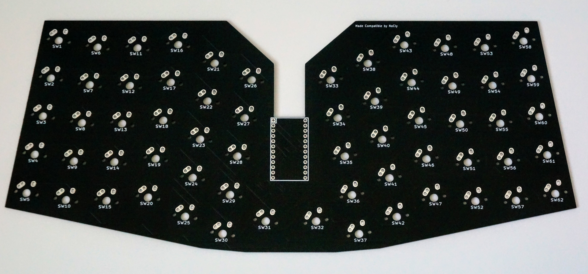
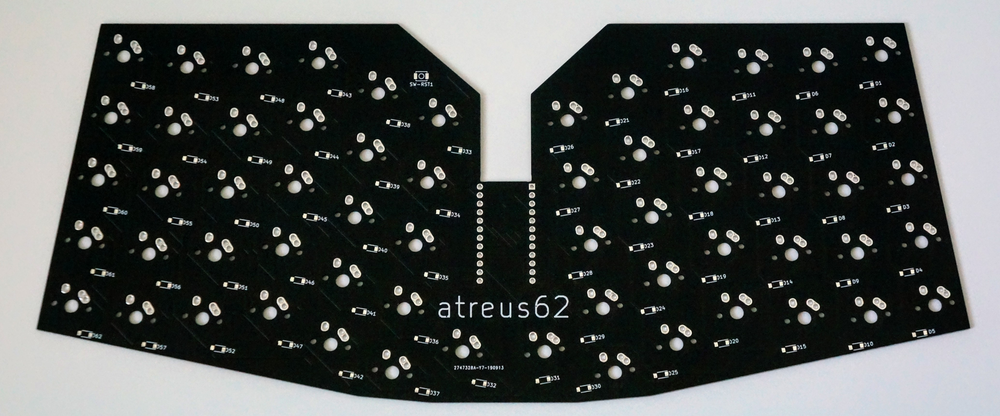

Adding here since pull request wasn't accpeted yet.
design modified from: https://github.com/profet23/atreus62 I updated the footprints and traces to be compatible with matias switches.

# atreus62
The mx_matias branch supports Matias / Alps switches as well as MX switches. 

!NOTE! The thumb switches for matias are only 1u on this because the switch holes are not rotated for 1.5u keys. The case automaticcally generates the thumbs in this orientation in OpenSCAD if the hole size is changed for matias. If you want to use 1.5u rotated thumbs you must modify the switch to fit with this pcb. If using 1u keycaps with the same switch orientation disregard this note.

Using MIT Licensed footprint https://github.com/ai03-2725/MX_Alps_Hybrid

Currently using it in my atreus62 matias clicky build. See pictures below of the PCB.

