# atreus62 Build Guide

Please review all steps carefully before beginning your build.

## Required Components

|Component|Quantity|
|---------|:--------:|
|[1N4148W-7-F Diodes](http://www.mouser.com/Search/ProductDetail.aspx?R=1N4148W-7-Fvirtualkey62110000virtualkey621-1N4148W-F) |62 (Buy a couple of extra)|
|[Pro Micro with headers](https://www.amazon.com/OSOYOO-ATmega32U4-arduino-Leonardo-ATmega328/dp/B012FOV17O)|1|
|Cherry MX Compatible Switches|62 (Buy a couple of extra)|
|[Micro USB Cable](https://www.amazon.com/AmazonBasics-Micro-USB-USB-2-0-Cable/dp/B013PVKXTS/)|1|
|[Atreus62 PCB](http://shop.profetkeyboards.com/product/atreus62-pcb)|1|
|[Atreus62 Case](http://shop.profetkeyboards.com/product/atreus62-case)|1|
|[Omrom B3U-1000P](https://www.mouser.com/ProductDetail/653-B3U-1000P/)|1 (Optional)|

##  PCB Assembly

## Step 1
Program the Pro Micro with your firmware. [QMK supports the Atreus62.](https://github.com/jackhumbert/qmk_firmware)

#### For information on compiling QMK please consult QMK documentation.

We're going to assume that you already have a .hex file called firmware.hex that you want to flash on to your Pro Micro.

In order to flash the device, you need to figure out which "serial port" your device is attached to. First of all, identify what serial devices (including virtual ones) are currently connected to your machine with this command:

```
ls /dev/tty*
```

On my machine, this produces the following:

```
/dev/tty    /dev/tty12  /dev/tty17  /dev/tty21  /dev/tty26  /dev/tty30 /dev/tty35  /dev/tty4   /dev/tty44  /dev/tty49  /dev/tty53  /dev/tty58 /dev/tty62  /dev/ttyS0
    /dev/tty0   /dev/tty13  /dev/tty18  /dev/tty22  /dev/tty27  /dev/tty31 /dev/tty36  /dev/tty40  /dev/tty45  /dev/tty5   /dev/tty54  /dev/tty59 /dev/tty63  /dev/ttyS1
    /dev/tty1   /dev/tty14  /dev/tty19  /dev/tty23  /dev/tty28  /dev/tty32 /dev/tty37  /dev/tty41  /dev/tty46  /dev/tty50  /dev/tty55  /dev/tty6  /dev/tty7   /dev/ttyS2
    /dev/tty10  /dev/tty15  /dev/tty2   /dev/tty24  /dev/tty29  /dev/tty33 /dev/tty38  /dev/tty42  /dev/tty47  /dev/tty51  /dev/tty56  /dev/tty60 /dev/tty8   /dev/ttyS3
    /dev/tty11  /dev/tty16  /dev/tty20  /dev/tty25  /dev/tty3   /dev/tty34 /dev/tty39  /dev/tty43  /dev/tty48  /dev/tty52  /dev/tty57  /dev/tty61 /dev/tty9   /dev/ttyUSB0
```

I run Debian, so this will likely be different for you if you use something else. Take a note of the output, we'll need it later.

#### If you've never flashed your device before:

If this is your first time flashing the Pro Micro, this part will be easy. On the Pro Micro's first boot, instead of trying to run code (that you haven't uploaded yet!), it just sticks in bootloader mode. So if you only want to flash firmware once and forget about it - good news.

Just plug in your device and it should automatically go into bootloader mode.

#### If you have previously flashed your device:

If you've previously flashed your Pro Micro, instead of going straight into bootloader mode it will try to run the code that you uploaded to it. To go into bootloader mode, you need to quickly connect the GND + RST pins twice, just as the device powers on.


Next, plug in your device and re-run the command, the same as before:

```
ls /dev/tty*
```

There should be one more output device than was seen previously. For me, it's `/dev/ttyACM0`.

To flash the device, you need to have AVRdude installed. On Linux, you can do this with your normal package manager. On Mac OS, I've heard from a reputable source that you need to install CrossPack.

Once it's installed, confirm that it works by just running avrdude on the command-line. It should throw some errors. If so, it works.

Once you have AVRdude set up, navigate to the directory with your .hex file in it. Then, run the following:

```
avrdude -p atmega32u4 -P YOUR_SERIAL_PORT  -c avr109  -U flash:w:filename.hex
```

Of course, replace YOUR_SERIAL_PORT with your serial port's device name, and filename.hex with the appropriate filename. For me, this line looks like this:

```
avrdude -p atmega32u4 -P /dev/ttyACM0  -c avr109  -U flash:w:Soarer_at2usb_v1.12_atmega32u4.hex
```

If it says ''device not in sync'' or similar, your device is no longer in bootloader mode. Unplug it, and get it back into bootloader mode like you did in the previous step, and try again.


### Step 2
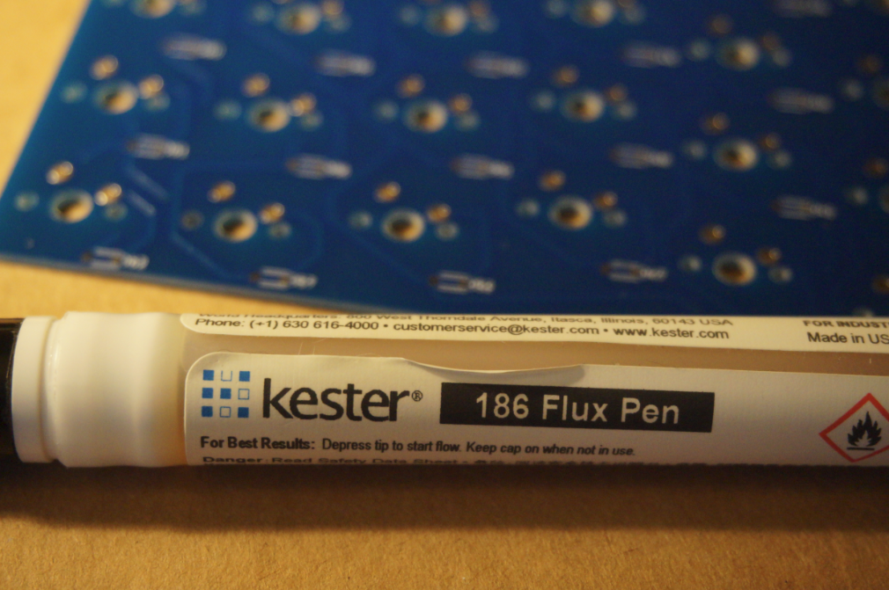

### Step 3
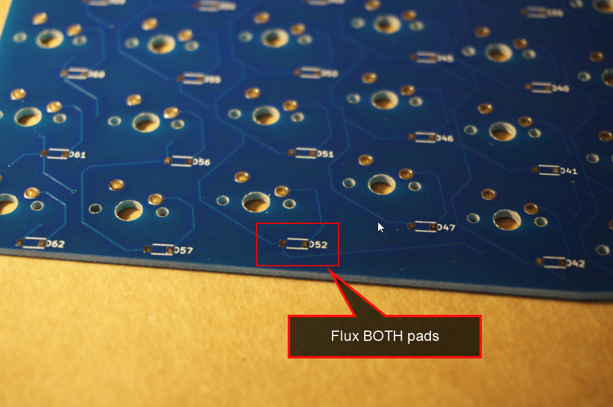

### Step 4
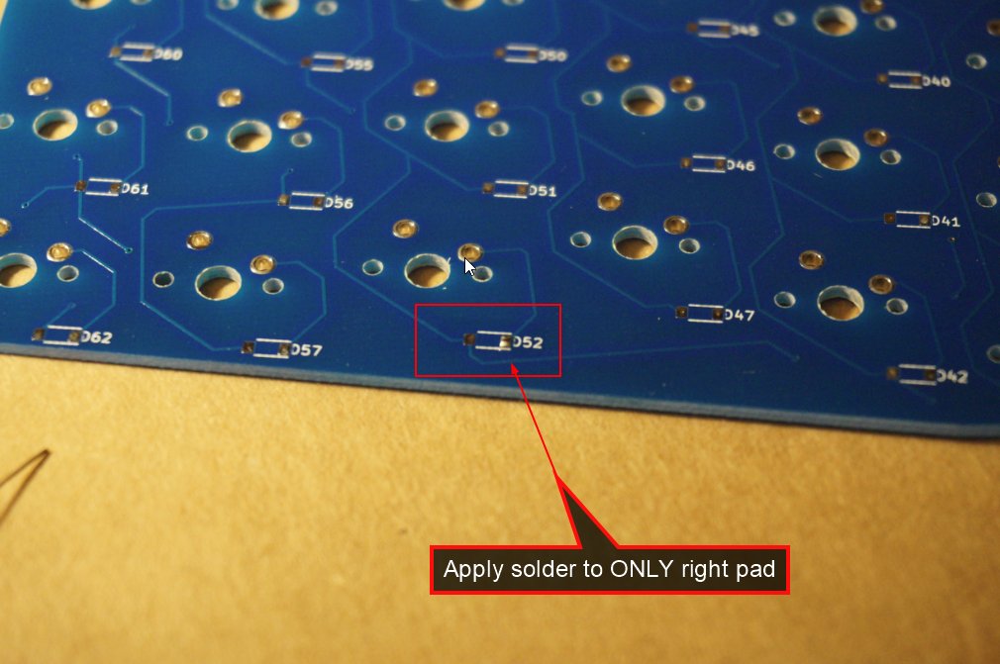

### Step 5
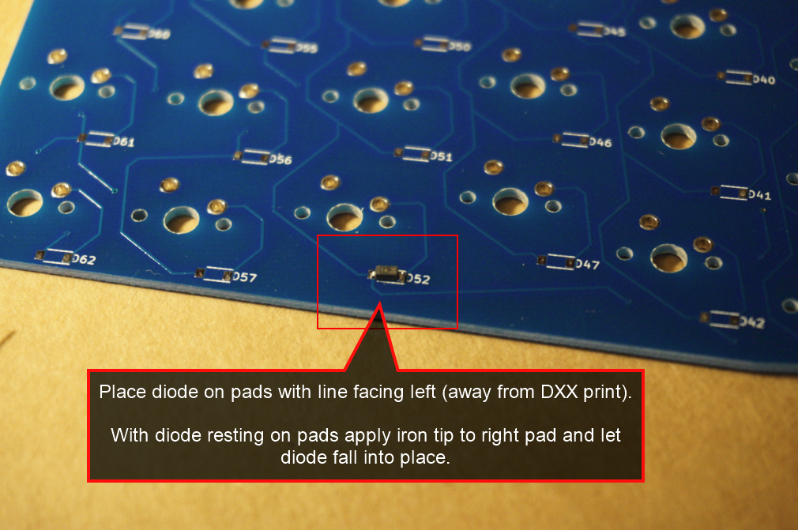

### Step 6
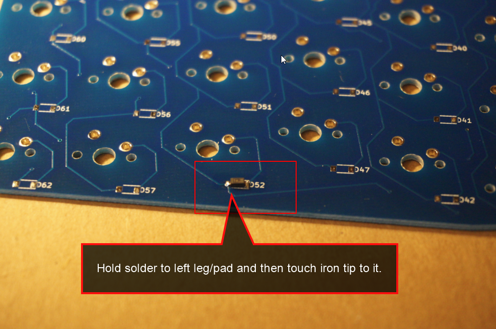

### Step 7
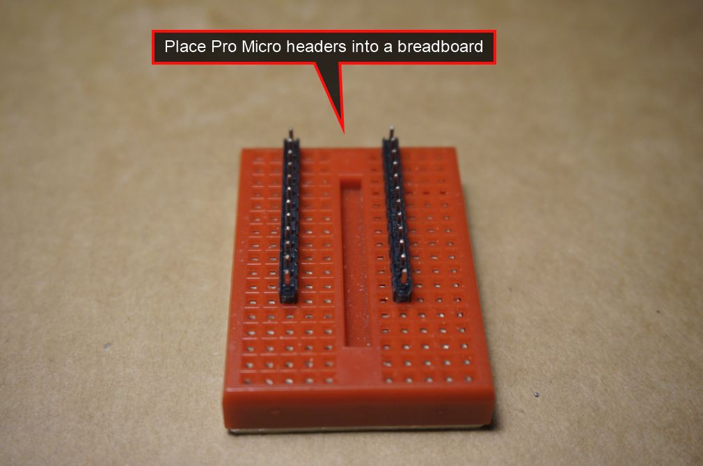

### Step 8
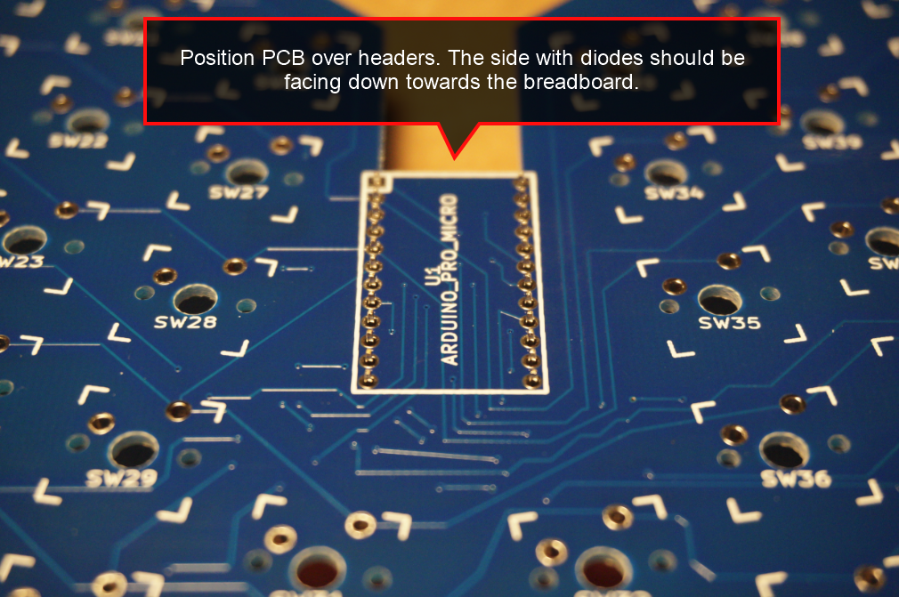

### Step 9
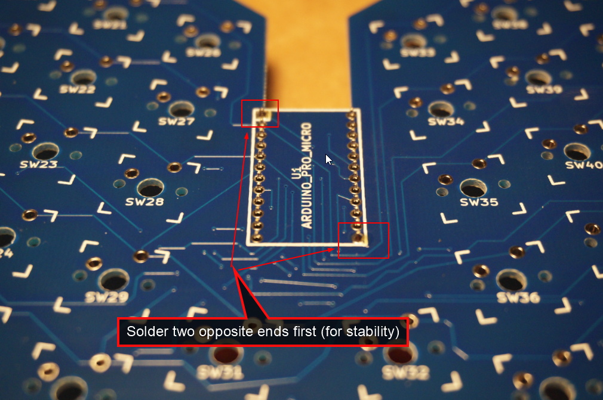

### Step 10
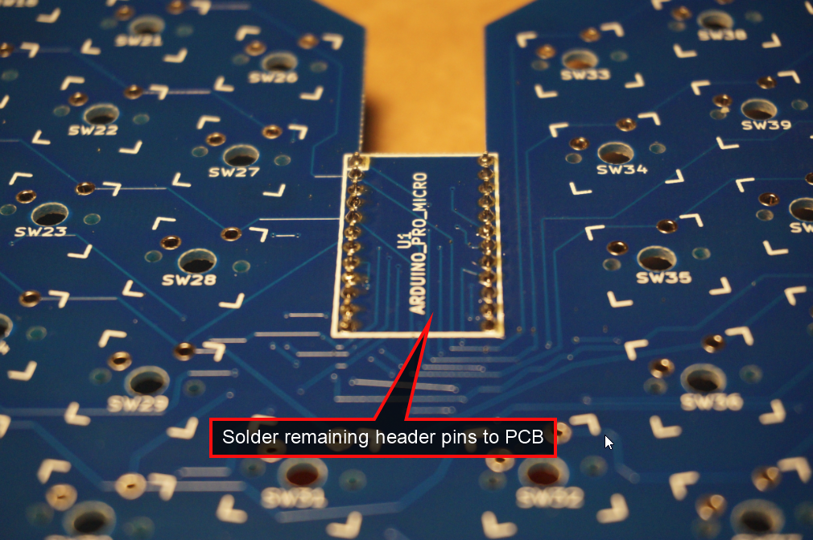

### Step 11


### Step 12
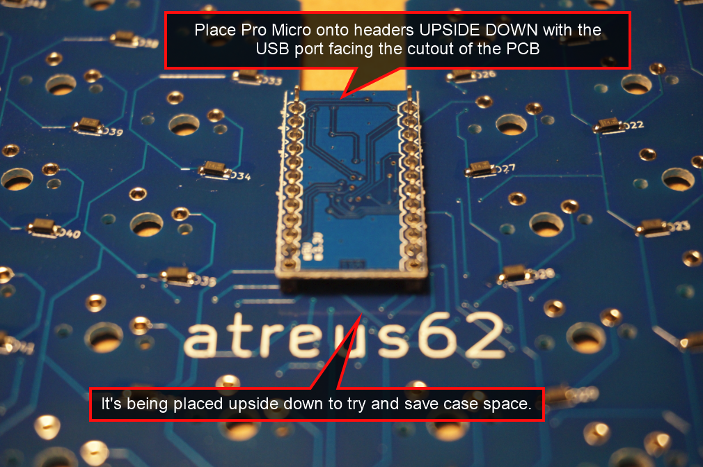

### Step 13
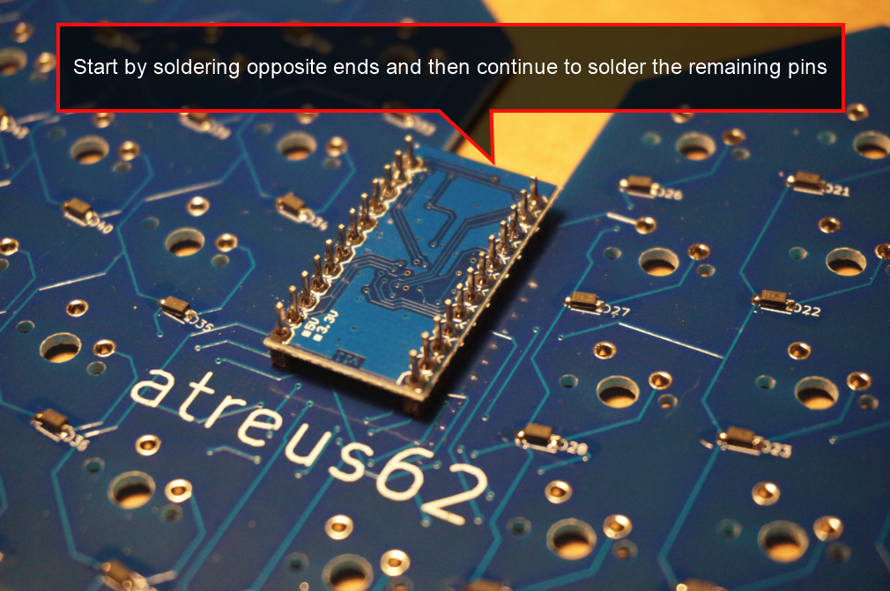

### Step 14


### Step 15
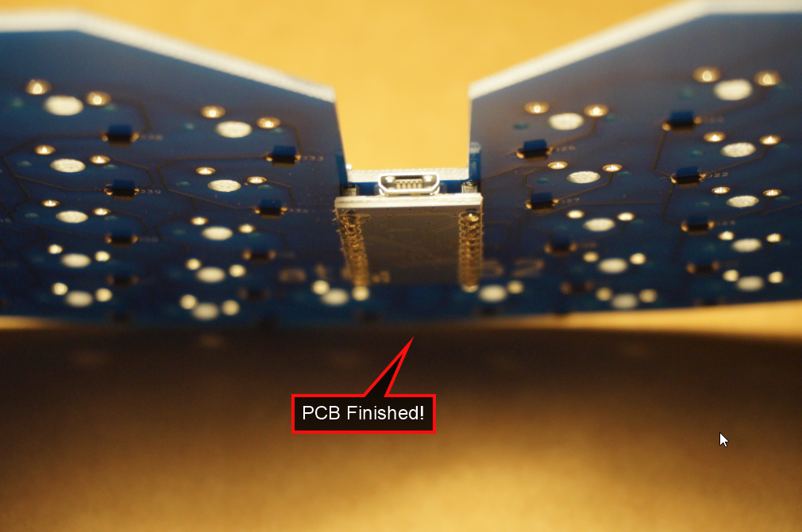
